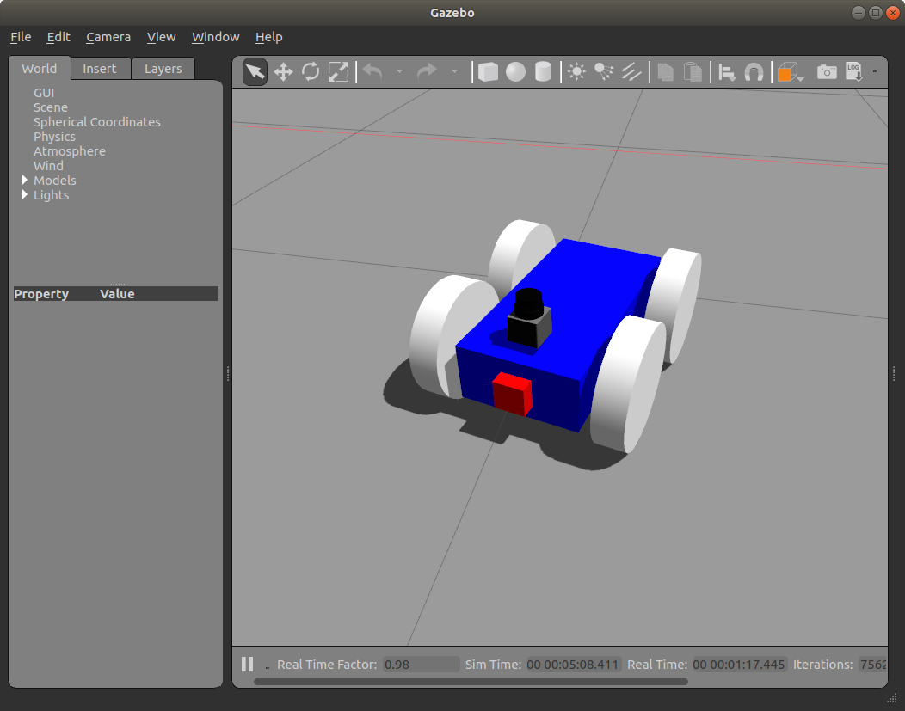
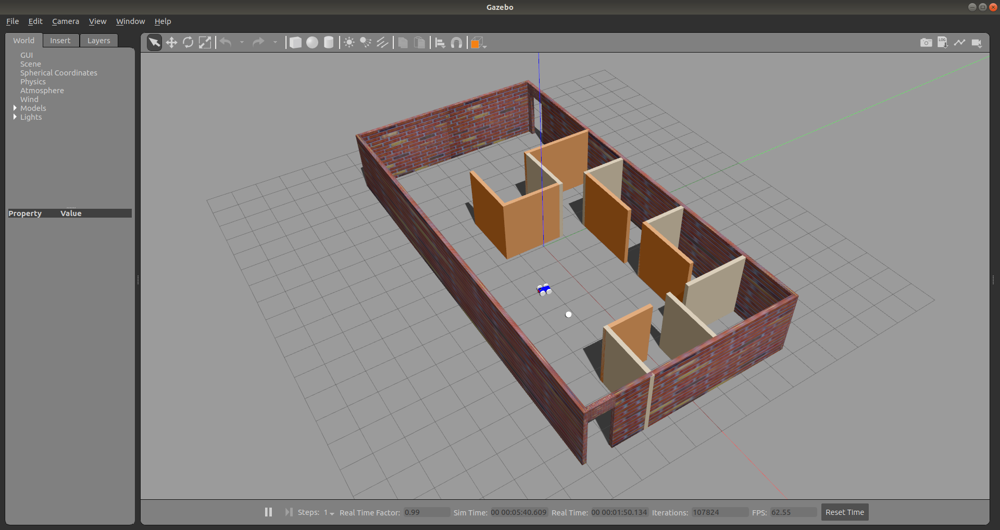
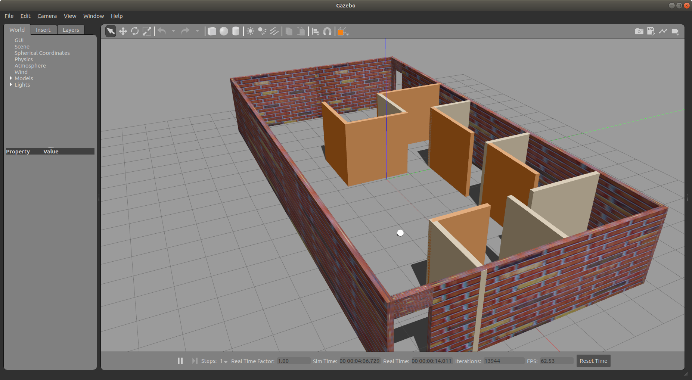

<video src="videos/chasing_ball.webm" width="800" height="480" controls preload></video>

Step-by-step developer guide to build a robot using [ROS 2](https://index.ros.org/doc/ros2/) (eloquent) and [Gazebo](http://gazebosim.org/). 

Make sure that you have installed ROS and Gazebo, following links will guide you.

- [ROS 2 Eloquent Elusor installation.](https://index.ros.org/doc/ros2/Installation/Eloquent/) **Binary Packages** installation is sufficient for this project, however if interested you can also choose **Building from source.** 

- [Gazebo installation](http://gazebosim.org/tutorials?cat=install)

While this project is build on Ubuntu 18.04, these instruction should also work on Windows 10 if you have ROS 2 and Gazebo installed, as you will learn, APIs, commands and process is same.

This guide assumes that you are 

- Developer with basic knowledge of programming in C++ and Python or

- Already knows ROS 1 and want to start with ROS 2, you can skip to [The Robot](#the-robot) below.

### Table of Contents
* **[Introduction](#introduction)**
* **[Basics](#basics)**
    * [Robot](#robot)
    * [ROS](#ROS)
    * [Gazebo](#gazebo)
* **[The Robot](#the-robot)**
* **[Setup](#setup)**

## Introduction

**Why learn Robotics?**

Robots are becoming more and more common. Apart from being pretty common in manufacturing processes, you also see them these days in the form of toys for kids, self operating vacuum cleaners, self driving cars, delivery drones, planet explorers to [humanoid robots](https://en.wikipedia.org/wiki/Sophia_(robot)) becoming citizen and getting award from UN. These are just few examples, and many more to come in future. So its a good idea to learn a thing or two about them!

**How to go about it?**

Before building an actual robot, you may want to use simulator to test your idea first. Once you are satisfied with your robot in simulation, then you can go on building an actual one.

ROS provides you framework to build various components of robots and establish secure communication between them, Gazebo provides simulation facilities to test your algorithms and robot design using realistic scenarios.  

**What will I learn here?**

You will learn how to put ROS and Gazebo together to create a robot with 4-wheels, camera and laser scan sensor and test its operations in a simulated world.

Let's get familiar with some basic concepts.

## Basics

### Robot

No matter what type of robot you are trying to build, your robot needs to perform three step process of perception, decision and action.

* Perception

Just like we humans perceive or sense environment around us using our eyes, ears, nose and touch, robots perceive their environment using one or more sensors. Some examples of sensor you may already know are radar, laser scan, camera, lidar, temperature sensor, sonar, chemical detection sensors etc.

* Decision

Based on inputs from sensors and current state of robot, robot can perform some decision making. Decisions can be as simple as answering weather yes or no question or as complicated as travelling on a path in unknown terrain on different planet.

* Action

Robot can perform various actions depending on decisions made using input. For example,  move from one place to another, move various parts like robot arm, send messages to another robots, speed up, slow down, stop etc.

We will see how ROS provide framework to perform these three basic processes.

### ROS

Robot Operating System is **not** an operating system like Linux or Windows, rather it is a framework that sits on top of an operating system and provide facilities for developing and running various components of a Robot.

Just like Microsoft Foundation Classes (MFC) is a framework to develop and run desktop application on windows in C++, or ASP.Net is a framework to develop and run website. Similarly ROS is a framework and provides facilities and libraries to develop and run a Robot using C++ and Python.

ROS 2 is next version of ROS 1. Most of the concepts are still same in ROS 2 however there are significant improvements in design and communications between various component. ROS 2 uses [DDS](https://index.ros.org/doc/ros2/Concepts/DDS-and-ROS-middleware-implementations/). 

It would be helpful but not required to learn ROS 1. As some of the concepts documentation still at ROS 1 wiki. Below are some useful links to learn about ROS.

- [ROS 1 tutorials](http://wiki.ros.org/ROS/Tutorials)

- [ROS 2 tutorials](https://index.ros.org/doc/ros2/)

- [nodes concept](http://wiki.ros.org/Nodes)
- [nodes in ROS 2](https://index.ros.org/doc/ros2/Tutorials/Understanding-ROS2-Nodes/#ros2nodes)

- [topics](http://wiki.ros.org/Topics)

- [Service/Client](http://wiki.ros.org/Services)

- [Publish/Subscribe](https://index.ros.org/doc/ros2/Tutorials/Writing-A-Simple-Cpp-Publisher-And-Subscriber/)

- [Quality of Services](https://index.ros.org/doc/ros2/Concepts/About-Quality-of-Service-Settings/)

- [build system colcon](https://index.ros.org/doc/ros2/Tutorials/Colcon-Tutorial/)


### Gazebo

Gazebo is widely used simulator with ROS. There are many amazing tutorials available online. Below are few link to get started.
- http://gazebosim.org/tutorials

- https://subscription.packtpub.com/book/hardware_and_creative/9781783554713/1/ch01lvl1sec11/simulators-of-ros

Assuming that you are now familiar with ROS and Gazebo, let's put it all together. 

## The Robot

Goal is to perform some action (drive the robot) based on the input gathered from sensors. We are going to do that in following steps.

* Build the simple office environment in gazebo simulator (see images below)
* Build the robot that will have (lets call it bocbot - **b**unch **o**f **c**oders **bot**)

    * Chassis (blue)
    * 4 wheels (white)
    * Camera (red)
    * Laser scan (black)

* Write node in C++ to process camera and laser scan input
* Write C++ node to send commands to wheels to drive the robot


Robot  


World 


## Steps

**Setup**

Open a new terminal and [source your ROS 2 installation](https://index.ros.org/doc/ros2/Tutorials/Configuring-ROS2-Environment/#configros2) so that ros2 commands will work.

```linux
        $ source /opt/ros/eloquent/setup.bash
        $ echo $ROS_DISTRO
        eloquent
        $
```

Create Workspace

```linux
        $ mkdir -p bocbot_ws/src
        $ cd bocbot_ws/src
```


**1. Building office environment in gazebo simulator**


Create bocbot package

```linux
        $ ros2 pkg create --build-type ament_cmake bocbot

        going to create a new package
        package name: bocbot
        destination directory: /home/trainer/bocbot_ws/src
        package format: 3
        version: 0.0.0
        description: TODO: Package description
        maintainer: ['trainer <contact@bunchofcoders.com>']
        licenses: ['TODO: License declaration']
        build type: ament_cmake
        dependencies: []
        creating folder ./bocbot
        creating ./bocbot/package.xml
        creating source and include folder
        creating folder ./bocbot/src
        creating folder ./bocbot/include/bocbot
        creating ./bocbot/CMakeLists.txt

        $ cd bocbot
```

Create directory for world file for office environment

```linux
        $ mkdir worlds
        $ cd worlds
        $ touch bocbot_office.world
       
```
A world file in Gazebo contains all the objects in the simulated environment. These objects are your robot model, its environment, lighting, sensors, and other objects. 

Gazebo uses [SDF](http://sdformat.org/) xml file format to save your simulation. The world file usually has a .world extension. Below is basic format of world file.

```xml
<?xml version="1.0" ?>
<sdf version='1.6'>
  <world name="default">
    <physics type="ode">
      ...
    </physics>

    <scene>
      ...
    </scene>

    <model name="box">
      ...
    </model>

    <model name="sphere">
      ...
    </model>

    <light name="spotlight">
      ...
    </light>

  </world>
</sdf>

```

Paste following code in `boc_office.world` that contains description of objects in simulation, such as light, ground plane, walls and the white ball, built with **Building Editor**.


<details>
<summary><I>boc_office.world (click to expand)</I></summary>

```xml
<sdf version='1.6'>
  <world name='default'>
    <light name='sun' type='directional'>
      <cast_shadows>1</cast_shadows>
      <pose frame=''>0 0 10 0 -0 0</pose>
      <diffuse>0.8 0.8 0.8 1</diffuse>
      <specular>0.2 0.2 0.2 1</specular>
      <attenuation>
        <range>1000</range>
        <constant>0.9</constant>
        <linear>0.01</linear>
        <quadratic>0.001</quadratic>
      </attenuation>
      <direction>-0.5 0.1 -0.9</direction>
    </light>
    <model name='ground_plane'>
      <static>1</static>
      <link name='link'>
        <collision name='collision'>
          <geometry>
            <plane>
              <normal>0 0 1</normal>
              <size>100 100</size>
            </plane>
          </geometry>
          <surface>
            <contact>
              <collide_bitmask>65535</collide_bitmask>
              <ode/>
            </contact>
            <friction>
              <ode>
                <mu>100</mu>
                <mu2>50</mu2>
              </ode>
              <torsional>
                <ode/>
              </torsional>
            </friction>
            <bounce/>
          </surface>
          <max_contacts>10</max_contacts>
        </collision>
        <visual name='visual'>
          <cast_shadows>0</cast_shadows>
          <geometry>
            <plane>
              <normal>0 0 1</normal>
              <size>100 100</size>
            </plane>
          </geometry>
          <material>
            <script>
              <uri>file://media/materials/scripts/gazebo.material</uri>
              <name>Gazebo/Grey</name>
            </script>
          </material>
        </visual>
        <self_collide>0</self_collide>
        <enable_wind>0</enable_wind>
        <kinematic>0</kinematic>
      </link>
    </model>
    <gravity>0 0 -9.8</gravity>
    <magnetic_field>6e-06 2.3e-05 -4.2e-05</magnetic_field>
    <atmosphere type='adiabatic'/>
    <physics name='default_physics' default='0' type='ode'>
      <max_step_size>0.001</max_step_size>
      <real_time_factor>1</real_time_factor>
      <real_time_update_rate>1000</real_time_update_rate>
    </physics>
    <scene>
      <ambient>0.4 0.4 0.4 1</ambient>
      <background>0.7 0.7 0.7 1</background>
      <shadows>1</shadows>
    </scene>
    <audio>
      <device>default</device>
    </audio>
    <wind/>
    <spherical_coordinates>
      <surface_model>EARTH_WGS84</surface_model>
      <latitude_deg>0</latitude_deg>
      <longitude_deg>0</longitude_deg>
      <elevation>0</elevation>
      <heading_deg>0</heading_deg>
    </spherical_coordinates>
    <model name='sudhir.building'>
      <pose frame=''>-1.27854 7.44696 0 0 -0 0</pose>
      <link name='Wall_0'>
        <collision name='Wall_0_Collision'>
          <geometry>
            <box>
              <size>4 0.15 2.5</size>
            </box>
          </geometry>
          <pose frame=''>0 0 1.25 0 -0 0</pose>
          <max_contacts>10</max_contacts>
          <surface>
            <contact>
              <ode/>
            </contact>
            <bounce/>
            <friction>
              <torsional>
                <ode/>
              </torsional>
              <ode/>
            </friction>
          </surface>
        </collision>
        <visual name='Wall_0_Visual'>
          <pose frame=''>0 0 1.25 0 -0 0</pose>
          <geometry>
            <box>
              <size>4 0.15 2.5</size>
            </box>
          </geometry>
          <material>
            <script>
              <uri>file://media/materials/scripts/gazebo.material</uri>
              <name>Gazebo/Bricks</name>
            </script>
            <ambient>1 1 1 1</ambient>
          </material>
          <meta>
            <layer>0</layer>
          </meta>
        </visual>
        <pose frame=''>-7.92943 1.85 0 0 -0 -1.5708</pose>
        <self_collide>0</self_collide>
        <enable_wind>0</enable_wind>
        <kinematic>0</kinematic>
      </link>
      <link name='Wall_10'>
        <collision name='Wall_10_Collision'>
          <geometry>
            <box>
              <size>2.5 0.15 2.5</size>
            </box>
          </geometry>
          <pose frame=''>0 0 1.25 0 -0 0</pose>
          <max_contacts>10</max_contacts>
          <surface>
            <contact>
              <ode/>
            </contact>
            <bounce/>
            <friction>
              <torsional>
                <ode/>
              </torsional>
              <ode/>
            </friction>
          </surface>
        </collision>
        <visual name='Wall_10_Visual'>
          <pose frame=''>0 0 1.25 0 -0 0</pose>
          <geometry>
            <box>
              <size>2.5 0.15 2.5</size>
            </box>
          </geometry>
          <material>
            <script>
              <uri>file://media/materials/scripts/gazebo.material</uri>
              <name>Gazebo/Grey</name>
            </script>
            <ambient>0.996078 0.47451 0.0196078 1</ambient>
          </material>
          <meta>
            <layer>0</layer>
          </meta>
        </visual>
        <pose frame=''>-0.891787 -0.14494 0 0 -0 -1.5708</pose>
        <self_collide>0</self_collide>
        <enable_wind>0</enable_wind>
        <kinematic>0</kinematic>
      </link>
      <link name='Wall_11'>
        <collision name='Wall_11_Collision'>
          <geometry>
            <box>
              <size>2.5 0.15 2.5</size>
            </box>
          </geometry>
          <pose frame=''>0 0 1.25 0 -0 0</pose>
          <max_contacts>10</max_contacts>
          <surface>
            <contact>
              <ode/>
            </contact>
            <bounce/>
            <friction>
              <torsional>
                <ode/>
              </torsional>
              <ode/>
            </friction>
          </surface>
        </collision>
        <visual name='Wall_11_Visual'>
          <pose frame=''>0 0 1.25 0 -0 0</pose>
          <geometry>
            <box>
              <size>2.5 0.15 2.5</size>
            </box>
          </geometry>
          <material>
            <script>
              <uri>file://media/materials/scripts/gazebo.material</uri>
              <name>Gazebo/Grey</name>
            </script>
            <ambient>0.996078 0.47451 0.0196078 1</ambient>
          </material>
          <meta>
            <layer>0</layer>
          </meta>
        </visual>
        <pose frame=''>-2.06679 -1.31994 0 0 -0 3.14159</pose>
        <self_collide>0</self_collide>
        <enable_wind>0</enable_wind>
        <kinematic>0</kinematic>
      </link>
      <link name='Wall_13'>
        <collision name='Wall_13_Collision'>
          <geometry>
            <box>
              <size>1.75 0.15 2.5</size>
            </box>
          </geometry>
          <pose frame=''>0 0 1.25 0 -0 0</pose>
          <max_contacts>10</max_contacts>
          <surface>
            <contact>
              <ode/>
            </contact>
            <bounce/>
            <friction>
              <torsional>
                <ode/>
              </torsional>
              <ode/>
            </friction>
          </surface>
        </collision>
        <visual name='Wall_13_Visual'>
          <pose frame=''>0 0 1.25 0 -0 0</pose>
          <geometry>
            <box>
              <size>1.75 0.15 2.5</size>
            </box>
          </geometry>
          <material>
            <script>
              <uri>file://media/materials/scripts/gazebo.material</uri>
              <name>Gazebo/Grey</name>
            </script>
            <ambient>0.921569 0.807843 0.615686 1</ambient>
          </material>
          <meta>
            <layer>0</layer>
          </meta>
        </visual>
        <pose frame=''>-0.908613 2.9996 0 0 -0 -1.5708</pose>
        <self_collide>0</self_collide>
        <enable_wind>0</enable_wind>
        <kinematic>0</kinematic>
      </link>
      <link name='Wall_14'>
        <collision name='Wall_14_Collision'>
          <geometry>
            <box>
              <size>2.75 0.15 2.5</size>
            </box>
          </geometry>
          <pose frame=''>0 0 1.25 0 -0 0</pose>
          <max_contacts>10</max_contacts>
          <surface>
            <contact>
              <ode/>
            </contact>
            <bounce/>
            <friction>
              <torsional>
                <ode/>
              </torsional>
              <ode/>
            </friction>
          </surface>
        </collision>
        <visual name='Wall_14_Visual'>
          <pose frame=''>0 0 1.25 0 -0 0</pose>
          <geometry>
            <box>
              <size>2.75 0.15 2.5</size>
            </box>
          </geometry>
          <material>
            <script>
              <uri>file://media/materials/scripts/gazebo.material</uri>
              <name>Gazebo/Grey</name>
            </script>
            <ambient>0.996078 0.47451 0.0196078 1</ambient>
          </material>
          <meta>
            <layer>0</layer>
          </meta>
        </visual>
        <pose frame=''>0.391387 2.19961 0 0 -0 0</pose>
        <self_collide>0</self_collide>
        <enable_wind>0</enable_wind>
        <kinematic>0</kinematic>
      </link>
      <link name='Wall_17'>
        <collision name='Wall_17_Collision'>
          <geometry>
            <box>
              <size>1.75 0.15 2.5</size>
            </box>
          </geometry>
          <pose frame=''>0 0 1.25 0 -0 0</pose>
          <max_contacts>10</max_contacts>
          <surface>
            <contact>
              <ode/>
            </contact>
            <bounce/>
            <friction>
              <torsional>
                <ode/>
              </torsional>
              <ode/>
            </friction>
          </surface>
        </collision>
        <visual name='Wall_17_Visual'>
          <pose frame=''>0 0 1.25 0 -0 0</pose>
          <geometry>
            <box>
              <size>1.75 0.15 2.5</size>
            </box>
          </geometry>
          <material>
            <script>
              <uri>file://media/materials/scripts/gazebo.material</uri>
              <name>Gazebo/Grey</name>
            </script>
            <ambient>0.921569 0.807843 0.615686 1</ambient>
          </material>
          <meta>
            <layer>0</layer>
          </meta>
        </visual>
        <pose frame=''>2.63138 3.01972 0 0 -0 -1.5708</pose>
        <self_collide>0</self_collide>
        <enable_wind>0</enable_wind>
        <kinematic>0</kinematic>
      </link>
      <link name='Wall_18'>
        <collision name='Wall_18_Collision'>
          <geometry>
            <box>
              <size>2.5 0.15 2.5</size>
            </box>
          </geometry>
          <pose frame=''>0 0 1.25 0 -0 0</pose>
          <max_contacts>10</max_contacts>
          <surface>
            <contact>
              <ode/>
            </contact>
            <bounce/>
            <friction>
              <torsional>
                <ode/>
              </torsional>
              <ode/>
            </friction>
          </surface>
        </collision>
        <visual name='Wall_18_Visual'>
          <pose frame=''>0 0 1.25 0 -0 0</pose>
          <geometry>
            <box>
              <size>2.5 0.15 2.5</size>
            </box>
          </geometry>
          <material>
            <script>
              <uri>file://media/materials/scripts/gazebo.material</uri>
              <name>Gazebo/Grey</name>
            </script>
            <ambient>0.996078 0.47451 0.0196078 1</ambient>
          </material>
          <meta>
            <layer>0</layer>
          </meta>
        </visual>
        <pose frame=''>3.80638 2.21972 0 0 -0 0</pose>
        <self_collide>0</self_collide>
        <enable_wind>0</enable_wind>
        <kinematic>0</kinematic>
      </link>
      <link name='Wall_20'>
        <collision name='Wall_20_Collision'>
          <geometry>
            <box>
              <size>2.5 0.15 2.5</size>
            </box>
          </geometry>
          <pose frame=''>0 0 1.25 0 -0 0</pose>
          <max_contacts>10</max_contacts>
          <surface>
            <contact>
              <ode/>
            </contact>
            <bounce/>
            <friction>
              <torsional>
                <ode/>
              </torsional>
              <ode/>
            </friction>
          </surface>
        </collision>
        <visual name='Wall_20_Visual'>
          <pose frame=''>0 0 1.25 0 -0 0</pose>
          <geometry>
            <box>
              <size>2.5 0.15 2.5</size>
            </box>
          </geometry>
          <material>
            <script>
              <uri>file://media/materials/scripts/gazebo.material</uri>
              <name>Gazebo/Grey</name>
            </script>
            <ambient>0.921569 0.807843 0.615686 1</ambient>
          </material>
          <meta>
            <layer>0</layer>
          </meta>
        </visual>
        <pose frame=''>5.74898 2.68495 0 0 -0 -1.5708</pose>
        <self_collide>0</self_collide>
        <enable_wind>0</enable_wind>
        <kinematic>0</kinematic>
      </link>
      <link name='Wall_22'>
        <collision name='Wall_22_Collision'>
          <geometry>
            <box>
              <size>2.25 0.15 2.5</size>
            </box>
          </geometry>
          <pose frame=''>0 0 1.25 0 -0 0</pose>
          <max_contacts>10</max_contacts>
          <surface>
            <contact>
              <ode/>
            </contact>
            <bounce/>
            <friction>
              <torsional>
                <ode/>
              </torsional>
              <ode/>
            </friction>
          </surface>
        </collision>
        <visual name='Wall_22_Visual'>
          <pose frame=''>0 0 1.25 0 -0 0</pose>
          <geometry>
            <box>
              <size>2.25 0.15 2.5</size>
            </box>
          </geometry>
          <material>
            <script>
              <uri>file://media/materials/scripts/gazebo.material</uri>
              <name>Gazebo/Grey</name>
            </script>
            <ambient>0.921569 0.807843 0.615686 1</ambient>
          </material>
          <meta>
            <layer>0</layer>
          </meta>
        </visual>
        <pose frame=''>6.81909 0.722229 0 0 -0 0</pose>
        <self_collide>0</self_collide>
        <enable_wind>0</enable_wind>
        <kinematic>0</kinematic>
      </link>
      <link name='Wall_24'>
        <collision name='Wall_24_Collision'>
          <geometry>
            <box>
              <size>1.75 0.15 2.5</size>
            </box>
          </geometry>
          <pose frame=''>0 0 1.25 0 -0 0</pose>
          <max_contacts>10</max_contacts>
          <surface>
            <contact>
              <ode/>
            </contact>
            <bounce/>
            <friction>
              <torsional>
                <ode/>
              </torsional>
              <ode/>
            </friction>
          </surface>
        </collision>
        <visual name='Wall_24_Visual'>
          <pose frame=''>0 0 1.25 0 -0 0</pose>
          <geometry>
            <box>
              <size>1.75 0.15 2.5</size>
            </box>
          </geometry>
          <material>
            <script>
              <uri>file://media/materials/scripts/gazebo.material</uri>
              <name>Gazebo/Grey</name>
            </script>
            <ambient>0.996078 0.47451 0.0196078 1</ambient>
          </material>
          <meta>
            <layer>0</layer>
          </meta>
        </visual>
        <pose frame=''>5.82943 -0.902428 0 0 -0 -1.5708</pose>
        <self_collide>0</self_collide>
        <enable_wind>0</enable_wind>
        <kinematic>0</kinematic>
      </link>
      <link name='Wall_25'>
        <collision name='Wall_25_Collision'>
          <geometry>
            <box>
              <size>2.25 0.15 2.5</size>
            </box>
          </geometry>
          <pose frame=''>0 0 1.25 0 -0 0</pose>
          <max_contacts>10</max_contacts>
          <surface>
            <contact>
              <ode/>
            </contact>
            <bounce/>
            <friction>
              <torsional>
                <ode/>
              </torsional>
              <ode/>
            </friction>
          </surface>
        </collision>
        <visual name='Wall_25_Visual'>
          <pose frame=''>0 0 1.25 0 -0 0</pose>
          <geometry>
            <box>
              <size>2.25 0.15 2.5</size>
            </box>
          </geometry>
          <material>
            <script>
              <uri>file://media/materials/scripts/gazebo.material</uri>
              <name>Gazebo/Grey</name>
            </script>
            <ambient>0.921569 0.807843 0.615686 1</ambient>
          </material>
          <meta>
            <layer>0</layer>
          </meta>
        </visual>
        <pose frame=''>6.87943 -1.70243 0 0 -0 0</pose>
        <self_collide>0</self_collide>
        <enable_wind>0</enable_wind>
        <kinematic>0</kinematic>
      </link>
      <link name='Wall_3'>
        <collision name='Wall_3_Collision'>
          <geometry>
            <box>
              <size>4 0.15 2.5</size>
            </box>
          </geometry>
          <pose frame=''>0 0 1.25 0 -0 0</pose>
          <max_contacts>10</max_contacts>
          <surface>
            <contact>
              <ode/>
            </contact>
            <bounce/>
            <friction>
              <torsional>
                <ode/>
              </torsional>
              <ode/>
            </friction>
          </surface>
        </collision>
        <visual name='Wall_3_Visual'>
          <pose frame=''>0 0 1.25 0 -0 0</pose>
          <geometry>
            <box>
              <size>4 0.15 2.5</size>
            </box>
          </geometry>
          <material>
            <script>
              <uri>file://media/materials/scripts/gazebo.material</uri>
              <name>Gazebo/Bricks</name>
            </script>
            <ambient>1 1 1 1</ambient>
          </material>
          <meta>
            <layer>0</layer>
          </meta>
        </visual>
        <pose frame=''>-7.92943 -2 0 0 -0 -1.5708</pose>
        <self_collide>0</self_collide>
        <enable_wind>0</enable_wind>
        <kinematic>0</kinematic>
      </link>
      <link name='Wall_4'>
        <collision name='Wall_4_Collision'>
          <geometry>
            <box>
              <size>16 0.15 2.5</size>
            </box>
          </geometry>
          <pose frame=''>0 0 1.25 0 -0 0</pose>
          <max_contacts>10</max_contacts>
          <surface>
            <contact>
              <ode/>
            </contact>
            <bounce/>
            <friction>
              <torsional>
                <ode/>
              </torsional>
              <ode/>
            </friction>
          </surface>
        </collision>
        <visual name='Wall_4_Visual'>
          <pose frame=''>0 0 1.25 0 -0 0</pose>
          <geometry>
            <box>
              <size>16 0.15 2.5</size>
            </box>
          </geometry>
          <material>
            <script>
              <uri>file://media/materials/scripts/gazebo.material</uri>
              <name>Gazebo/Bricks</name>
            </script>
            <ambient>1 1 1 1</ambient>
          </material>
          <meta>
            <layer>0</layer>
          </meta>
        </visual>
        <pose frame=''>-0.004434 -3.925 0 0 -0 0</pose>
        <self_collide>0</self_collide>
        <enable_wind>0</enable_wind>
        <kinematic>0</kinematic>
      </link>
      <link name='Wall_5'>
        <pose frame=''>7.92057 0 0 0 -0 1.5708</pose>
        <visual name='Wall_5_Visual_0'>
          <pose frame=''>-3.92553 0 1.25 0 -0 0</pose>
          <geometry>
            <box>
              <size>0.148947 0.15 2.5</size>
            </box>
          </geometry>
          <material>
            <script>
              <uri>file://media/materials/scripts/gazebo.material</uri>
              <name>Gazebo/Bricks</name>
            </script>
            <ambient>1 1 1 1</ambient>
          </material>
          <meta>
            <layer>0</layer>
          </meta>
        </visual>
        <collision name='Wall_5_Collision_0'>
          <geometry>
            <box>
              <size>0.148947 0.15 2.5</size>
            </box>
          </geometry>
          <pose frame=''>-3.92553 0 1.25 0 -0 0</pose>
          <max_contacts>10</max_contacts>
          <surface>
            <contact>
              <ode/>
            </contact>
            <bounce/>
            <friction>
              <torsional>
                <ode/>
              </torsional>
              <ode/>
            </friction>
          </surface>
        </collision>
        <visual name='Wall_5_Visual_1'>
          <pose frame=''>0.524473 0 1.25 0 -0 0</pose>
          <geometry>
            <box>
              <size>6.95105 0.15 2.5</size>
            </box>
          </geometry>
          <material>
            <script>
              <uri>file://media/materials/scripts/gazebo.material</uri>
              <name>Gazebo/Bricks</name>
            </script>
            <ambient>1 1 1 1</ambient>
          </material>
          <meta>
            <layer>0</layer>
          </meta>
        </visual>
        <collision name='Wall_5_Collision_1'>
          <geometry>
            <box>
              <size>6.95105 0.15 2.5</size>
            </box>
          </geometry>
          <pose frame=''>0.524473 0 1.25 0 -0 0</pose>
          <max_contacts>10</max_contacts>
          <surface>
            <contact>
              <ode/>
            </contact>
            <bounce/>
            <friction>
              <torsional>
                <ode/>
              </torsional>
              <ode/>
            </friction>
          </surface>
        </collision>
        <visual name='Wall_5_Visual_2'>
          <pose frame=''>-3.40105 0 2.25 0 -0 0</pose>
          <geometry>
            <box>
              <size>0.9 0.15 0.5</size>
            </box>
          </geometry>
          <material>
            <script>
              <uri>file://media/materials/scripts/gazebo.material</uri>
              <name>Gazebo/Bricks</name>
            </script>
            <ambient>1 1 1 1</ambient>
          </material>
          <meta>
            <layer>0</layer>
          </meta>
        </visual>
        <collision name='Wall_5_Collision_2'>
          <geometry>
            <box>
              <size>0.9 0.15 0.5</size>
            </box>
          </geometry>
          <pose frame=''>-3.40105 0 2.25 0 -0 0</pose>
          <max_contacts>10</max_contacts>
          <surface>
            <contact>
              <ode/>
            </contact>
            <bounce/>
            <friction>
              <torsional>
                <ode/>
              </torsional>
              <ode/>
            </friction>
          </surface>
        </collision>
        <self_collide>0</self_collide>
        <enable_wind>0</enable_wind>
        <kinematic>0</kinematic>
      </link>
      <link name='Wall_6'>
        <pose frame=''>-0.004434 3.925 0 0 -0 3.14159</pose>
        <visual name='Wall_6_Visual_0'>
          <pose frame=''>-0.655307 0 1.25 0 -0 0</pose>
          <geometry>
            <box>
              <size>14.6894 0.15 2.5</size>
            </box>
          </geometry>
          <material>
            <script>
              <uri>file://media/materials/scripts/gazebo.material</uri>
              <name>Gazebo/Bricks</name>
            </script>
            <ambient>1 1 1 1</ambient>
          </material>
          <meta>
            <layer>0</layer>
          </meta>
        </visual>
        <collision name='Wall_6_Collision_0'>
          <geometry>
            <box>
              <size>14.6894 0.15 2.5</size>
            </box>
          </geometry>
          <pose frame=''>-0.655307 0 1.25 0 -0 0</pose>
          <max_contacts>10</max_contacts>
          <surface>
            <contact>
              <ode/>
            </contact>
            <bounce/>
            <friction>
              <torsional>
                <ode/>
              </torsional>
              <ode/>
            </friction>
          </surface>
        </collision>
        <visual name='Wall_6_Visual_1'>
          <pose frame=''>7.79469 0 1.25 0 -0 0</pose>
          <geometry>
            <box>
              <size>0.410614 0.15 2.5</size>
            </box>
          </geometry>
          <material>
            <script>
              <uri>file://media/materials/scripts/gazebo.material</uri>
              <name>Gazebo/Bricks</name>
            </script>
            <ambient>1 1 1 1</ambient>
          </material>
          <meta>
            <layer>0</layer>
          </meta>
        </visual>
        <collision name='Wall_6_Collision_1'>
          <geometry>
            <box>
              <size>0.410614 0.15 2.5</size>
            </box>
          </geometry>
          <pose frame=''>7.79469 0 1.25 0 -0 0</pose>
          <max_contacts>10</max_contacts>
          <surface>
            <contact>
              <ode/>
            </contact>
            <bounce/>
            <friction>
              <torsional>
                <ode/>
              </torsional>
              <ode/>
            </friction>
          </surface>
        </collision>
        <visual name='Wall_6_Visual_2'>
          <pose frame=''>7.13939 0 2.25 0 -0 0</pose>
          <geometry>
            <box>
              <size>0.9 0.15 0.5</size>
            </box>
          </geometry>
          <material>
            <script>
              <uri>file://media/materials/scripts/gazebo.material</uri>
              <name>Gazebo/Bricks</name>
            </script>
            <ambient>1 1 1 1</ambient>
          </material>
          <meta>
            <layer>0</layer>
          </meta>
        </visual>
        <collision name='Wall_6_Collision_2'>
          <geometry>
            <box>
              <size>0.9 0.15 0.5</size>
            </box>
          </geometry>
          <pose frame=''>7.13939 0 2.25 0 -0 0</pose>
          <max_contacts>10</max_contacts>
          <surface>
            <contact>
              <ode/>
            </contact>
            <bounce/>
            <friction>
              <torsional>
                <ode/>
              </torsional>
              <ode/>
            </friction>
          </surface>
        </collision>
        <self_collide>0</self_collide>
        <enable_wind>0</enable_wind>
        <kinematic>0</kinematic>
      </link>
      <link name='Wall_8'>
        <collision name='Wall_8_Collision'>
          <geometry>
            <box>
              <size>3 0.15 2.5</size>
            </box>
          </geometry>
          <pose frame=''>0 0 1.25 0 -0 0</pose>
          <max_contacts>10</max_contacts>
          <surface>
            <contact>
              <ode/>
            </contact>
            <bounce/>
            <friction>
              <torsional>
                <ode/>
              </torsional>
              <ode/>
            </friction>
          </surface>
        </collision>
        <visual name='Wall_8_Visual'>
          <pose frame=''>0 0 1.25 0 -0 0</pose>
          <geometry>
            <box>
              <size>3 0.15 2.5</size>
            </box>
          </geometry>
          <material>
            <script>
              <uri>file://media/materials/scripts/gazebo.material</uri>
              <name>Gazebo/Grey</name>
            </script>
            <ambient>0.996078 0.47451 0.0196078 1</ambient>
          </material>
          <meta>
            <layer>0</layer>
          </meta>
        </visual>
        <pose frame=''>-3.24179 2.45506 0 0 -0 -1.5708</pose>
        <self_collide>0</self_collide>
        <enable_wind>0</enable_wind>
        <kinematic>0</kinematic>
      </link>
      <link name='Wall_9'>
        <collision name='Wall_9_Collision'>
          <geometry>
            <box>
              <size>2.5 0.15 2.5</size>
            </box>
          </geometry>
          <pose frame=''>0 0 1.25 0 -0 0</pose>
          <max_contacts>10</max_contacts>
          <surface>
            <contact>
              <ode/>
            </contact>
            <bounce/>
            <friction>
              <torsional>
                <ode/>
              </torsional>
              <ode/>
            </friction>
          </surface>
        </collision>
        <visual name='Wall_9_Visual'>
          <pose frame=''>0 0 1.25 0 -0 0</pose>
          <geometry>
            <box>
              <size>2.5 0.15 2.5</size>
            </box>
          </geometry>
          <material>
            <script>
              <uri>file://media/materials/scripts/gazebo.material</uri>
              <name>Gazebo/Grey</name>
            </script>
            <ambient>0.921569 0.807843 0.615686 1</ambient>
          </material>
          <meta>
            <layer>0</layer>
          </meta>
        </visual>
        <pose frame=''>-2.06679 1.03006 0 0 -0 0</pose>
        <self_collide>0</self_collide>
        <enable_wind>0</enable_wind>
        <kinematic>0</kinematic>
      </link>
      <static>1</static>
    </model>
    <state world_name='default'>
      <sim_time>232 785000000</sim_time>
      <real_time>118 702538223</real_time>
      <wall_time>1551031600 831011974</wall_time>
      <iterations>118381</iterations>
      <model name='ground_plane'>
        <pose frame=''>0 0 0 0 -0 0</pose>
        <scale>1 1 1</scale>
        <link name='link'>
          <pose frame=''>0 0 0 0 -0 0</pose>
          <velocity>0 0 0 0 -0 0</velocity>
          <acceleration>0 0 0 0 -0 0</acceleration>
          <wrench>0 0 0 0 -0 0</wrench>
        </link>
      </model>
      <model name='my_ball'>
        <pose frame=''>3.55994 -1.22025 0.1 0.018695 -0 0</pose>
        <scale>1 1 1</scale>
        <link name='link_0'>
          <pose frame=''>3.55994 -1.22025 0.1 0.018695 -0 0</pose>
          <velocity>0 0 0 0 -0 0</velocity>
          <acceleration>0 0 0 0 -0 0</acceleration>
          <wrench>0 0 0 0 -0 0</wrench>
        </link>
      </model>
      <model name='sudhir.building'>
        <pose frame=''>0.673102 -0.134423 0 0 -0 0</pose>
        <scale>1 1 1</scale>
        <link name='Wall_0'>
          <pose frame=''>-7.25633 1.71558 0 0 0 -1.5708</pose>
          <velocity>0 0 0 0 -0 0</velocity>
          <acceleration>0 0 0 0 -0 0</acceleration>
          <wrench>0 0 0 0 -0 0</wrench>
        </link>
        <link name='Wall_10'>
          <pose frame=''>-0.218688 -0.279363 0 0 0 -1.5708</pose>
          <velocity>0 0 0 0 -0 0</velocity>
          <acceleration>0 0 0 0 -0 0</acceleration>
          <wrench>0 0 0 0 -0 0</wrench>
        </link>
        <link name='Wall_11'>
          <pose frame=''>-1.39369 -1.45436 0 0 -0 3.14159</pose>
          <velocity>0 0 0 0 -0 0</velocity>
          <acceleration>0 0 0 0 -0 0</acceleration>
          <wrench>0 0 0 0 -0 0</wrench>
        </link>
        <link name='Wall_13'>
          <pose frame=''>-0.235508 2.86522 0 0 0 -1.5708</pose>
          <velocity>0 0 0 0 -0 0</velocity>
          <acceleration>0 0 0 0 -0 0</acceleration>
          <wrench>0 0 0 0 -0 0</wrench>
        </link>
        <link name='Wall_14'>
          <pose frame=''>1.06449 2.06519 0 0 -0 0</pose>
          <velocity>0 0 0 0 -0 0</velocity>
          <acceleration>0 0 0 0 -0 0</acceleration>
          <wrench>0 0 0 0 -0 0</wrench>
        </link>
        <link name='Wall_17'>
          <pose frame=''>3.30448 2.88532 0 0 0 -1.5708</pose>
          <velocity>0 0 0 0 -0 0</velocity>
          <acceleration>0 0 0 0 -0 0</acceleration>
          <wrench>0 0 0 0 -0 0</wrench>
        </link>
        <link name='Wall_18'>
          <pose frame=''>4.47948 2.0853 0 0 -0 0</pose>
          <velocity>0 0 0 0 -0 0</velocity>
          <acceleration>0 0 0 0 -0 0</acceleration>
          <wrench>0 0 0 0 -0 0</wrench>
        </link>
        <link name='Wall_20'>
          <pose frame=''>6.42208 2.55052 0 0 0 -1.5708</pose>
          <velocity>0 0 0 0 -0 0</velocity>
          <acceleration>0 0 0 0 -0 0</acceleration>
          <wrench>0 0 0 0 -0 0</wrench>
        </link>
        <link name='Wall_22'>
          <pose frame=''>7.49219 0.587807 0 0 -0 0</pose>
          <velocity>0 0 0 0 -0 0</velocity>
          <acceleration>0 0 0 0 -0 0</acceleration>
          <wrench>0 0 0 0 -0 0</wrench>
        </link>
        <link name='Wall_24'>
          <pose frame=''>6.50253 -1.03685 0 0 0 -1.5708</pose>
          <velocity>0 0 0 0 -0 0</velocity>
          <acceleration>0 0 0 0 -0 0</acceleration>
          <wrench>0 0 0 0 -0 0</wrench>
        </link>
        <link name='Wall_25'>
          <pose frame=''>7.55253 -1.83685 0 0 -0 0</pose>
          <velocity>0 0 0 0 -0 0</velocity>
          <acceleration>0 0 0 0 -0 0</acceleration>
          <wrench>0 0 0 0 -0 0</wrench>
        </link>
        <link name='Wall_3'>
          <pose frame=''>-7.25633 -2.13442 0 0 0 -1.5708</pose>
          <velocity>0 0 0 0 -0 0</velocity>
          <acceleration>0 0 0 0 -0 0</acceleration>
          <wrench>0 0 0 0 -0 0</wrench>
        </link>
        <link name='Wall_4'>
          <pose frame=''>0.668672 -4.05942 0 0 -0 0</pose>
          <velocity>0 0 0 0 -0 0</velocity>
          <acceleration>0 0 0 0 -0 0</acceleration>
          <wrench>0 0 0 0 -0 0</wrench>
        </link>
        <link name='Wall_5'>
          <pose frame=''>8.59367 -0.134423 0 0 -0 1.5708</pose>
          <velocity>0 0 0 0 -0 0</velocity>
          <acceleration>0 0 0 0 -0 0</acceleration>
          <wrench>0 0 0 0 -0 0</wrench>
        </link>
        <link name='Wall_6'>
          <pose frame=''>0.668672 3.79062 0 0 -0 3.14159</pose>
          <velocity>0 0 0 0 -0 0</velocity>
          <acceleration>0 0 0 0 -0 0</acceleration>
          <wrench>0 0 0 0 -0 0</wrench>
        </link>
        <link name='Wall_8'>
          <pose frame=''>-2.56869 2.32064 0 0 0 -1.5708</pose>
          <velocity>0 0 0 0 -0 0</velocity>
          <acceleration>0 0 0 0 -0 0</acceleration>
          <wrench>0 0 0 0 -0 0</wrench>
        </link>
        <link name='Wall_9'>
          <pose frame=''>-1.39369 0.895637 0 0 -0 0</pose>
          <velocity>0 0 0 0 -0 0</velocity>
          <acceleration>0 0 0 0 -0 0</acceleration>
          <wrench>0 0 0 0 -0 0</wrench>
        </link>
      </model>
      <light name='sun'>
        <pose frame=''>0 0 10 0 -0 0</pose>
      </light>
    </state>
    <gui fullscreen='0'>
      <camera name='user_camera'>
        <pose frame=''>15.4065 -7.32713 9.3415 -0 0.531643 2.6842</pose>
        <view_controller>orbit</view_controller>
        <projection_type>perspective</projection_type>
      </camera>
    </gui>
    <model name='my_ball'>
      <link name='link_0'>
        <inertial>
          <mass>1</mass>
          <inertia>
            <ixx>0.1</ixx>
            <ixy>0</ixy>
            <ixz>0</ixz>
            <iyy>0.1</iyy>
            <iyz>0</iyz>
            <izz>0.1</izz>
          </inertia>
          <pose frame=''>0 0 0 0 -0 0</pose>
        </inertial>
        <pose frame=''>-0 -0 0 0 -0 0</pose>
        <gravity>1</gravity>
        <self_collide>0</self_collide>
        <kinematic>0</kinematic>
        <enable_wind>0</enable_wind>
        <visual name='visual'>
          <pose frame=''>0 0 0 0 -0 0</pose>
          <geometry>
            <sphere>
              <radius>0.1</radius>
            </sphere>
          </geometry>
          <material>
            <lighting>1</lighting>
            <script>
              <uri>file://media/materials/scripts/gazebo.material</uri>
              <name>Gazebo/Grey</name>
            </script>
            <shader type='vertex'>
              <normal_map>__default__</normal_map>
            </shader>
            <ambient>1 1 1 1</ambient>
            <diffuse>1 1 1 1</diffuse>
            <specular>1 1 1 1</specular>
            <emissive>1 1 1 1</emissive>
          </material>
          <transparency>0</transparency>
          <cast_shadows>1</cast_shadows>
        </visual>
        <collision name='collision'>
          <laser_retro>0</laser_retro>
          <max_contacts>10</max_contacts>
          <pose frame=''>0 0 0 0 -0 0</pose>
          <geometry>
            <sphere>
              <radius>0.1</radius>
            </sphere>
          </geometry>
          <surface>
            <friction>
              <ode>
                <mu>1</mu>
                <mu2>1</mu2>
                <fdir1>0 0 0</fdir1>
                <slip1>0</slip1>
                <slip2>0</slip2>
              </ode>
              <torsional>
                <coefficient>1</coefficient>
                <patch_radius>0</patch_radius>
                <surface_radius>0</surface_radius>
                <use_patch_radius>1</use_patch_radius>
                <ode>
                  <slip>0</slip>
                </ode>
              </torsional>
            </friction>
            <bounce>
              <restitution_coefficient>0</restitution_coefficient>
              <threshold>1e+06</threshold>
            </bounce>
            <contact>
              <collide_without_contact>0</collide_without_contact>
              <collide_without_contact_bitmask>1</collide_without_contact_bitmask>
              <collide_bitmask>1</collide_bitmask>
              <ode>
                <soft_cfm>0</soft_cfm>
                <soft_erp>0.2</soft_erp>
                <kp>1e+13</kp>
                <kd>1</kd>
                <max_vel>0.01</max_vel>
                <min_depth>0</min_depth>
              </ode>
              <bullet>
                <split_impulse>1</split_impulse>
                <split_impulse_penetration_threshold>-0.01</split_impulse_penetration_threshold>
                <soft_cfm>0</soft_cfm>
                <soft_erp>0.2</soft_erp>
                <kp>1e+13</kp>
                <kd>1</kd>
              </bullet>
            </contact>
          </surface>
        </collision>
      </link>
      <static>0</static>
      <allow_auto_disable>1</allow_auto_disable>
      <pose frame=''>3.55994 1.41227 0 0 -0 0</pose>
    </model>
  </world>
</sdf>

```
</details>

At this point you should be able to launch world in gazebo using

``` linux
    $ gazebo boc_office.world
```

You should see this. You will later know why white ball is there.




Alternatively you can create your own world by following below tutorials.

[Building the world](http://gazebosim.org/tutorials?cat=build_world)

[Create buildings in the world](http://gazebosim.org/tutorials?cat=build_world&tut=building_editor)

Make sure that you save your world file as `boc_office.world` in `bocbot_ws/src/bocbot/worlds` directory.

**2. Building the robot**

You are now familiar with SDF files to describe objects in simulation. ROS uses Universal Robot Description Format (URDF) to model a robot where various dynamic and kinematic properties are described in xml. [You can learn more here](https://industrial-training-master.readthedocs.io/en/melodic/_source/session3/Intro-to-URDF.html) Simple URDF looks like 

```xml
<?xml version="1.0"?>
<robot name="two_link_robot">
  <!--Links-->

  <link name="link_1">
    <visual>
      <geometry>
        <cylinder length="0.5" radius="0.2"/>
      </geometry>
    </visual>
  </link>

  <link name="link_2">
    <visual>
      <geometry>
        <box size="0.6 0.1 0.2"/>
      </geometry>
    </visual>
  </link>

  <!--Joints-->
  <joint name="joint_1" type="continuous">
    <parent link="link_1"/>
    <child link="link_2"/>
  </joint>
</robot>
```

As we define various robot elements in URDF, it tends to get very big. To manage various component individually and reuse them, ROS has a package called `xacro` (XML Macro) that enables you to combine different URDF files in one file. It also provides template facility to define variables in these files. We save those files with `.xacro` extension. [You can learn more about XACRO here.](http://wiki.ros.org/xacro)

We are going to create two xacro files, one to describe robot and other one describing gazebo plugins briefly explained below, used for interactions in simulation.

For gazebo plugins to work, make sure that you have following ROS 2 packages installed.

    gazebo_dev
    gazebo_msgs
    gazebo_plugins
    gazebo_ros
    gazebo_ros_pkgs

You can check this by running following command
```linux
    $ ros2 pkg list
```

The set of ROS 2 packages for interfacing with Gazebo are contained within a meta package named gazebo_ros_pkgs

In case you need to install them, use following command 

```linux
    $ sudo apt install ros-eloquent-gazebo-ros-pkgs
```

    Note: all ros packages follow this convention ros-<distro>-<package-name>, note underscores in package name are replaced by dash "-".

**Gazebo Plugins**

A plugin is a chunk of code that is compiled as a shared library and inserted into the simulation. The plugin has direct access to all the functionality of Gazebo through the standard C++ classes.

Plugins are useful because they:

* let developers control almost any aspect of Gazebo
* are self-contained routines that are easily shared
* can be inserted and removed from a running system

[You can learn more about plugins here.](http://gazebosim.org/tutorials/?tut=plugins_hello_world)

Instead of writing our own, we are going to use existing plugins provided by gazebo_ros_pkgs. We will use

1. Skid steer drive controller to help move wheels of robot independently, provided by `libgazebo_ros_diff_drive.so`, [more details here.](https://github.com/ros-simulation/gazebo_ros_pkgs/wiki/ROS-2-Migration:-Skid-Steer-drive)

2. Camera controller to read images captured by camera in simulation, provided by `libgazebo_ros_camera.so`, [more details here.](https://github.com/ros-simulation/gazebo_ros_pkgs/wiki/ROS-2-Migration:-Camera)

3. Laser scan controller to read point cloud data from laser scanner, provided by `libgazebo_ros_ray_sensor.so`, [more details here.](https://github.com/ros-simulation/gazebo_ros_pkgs/wiki/ROS-2-Migration:-Ray-sensors)

You will find these libraries in `/opt/ros/eloquent/lib` directory.

We will define various properties required by these controllers in `bocbot.gazebo` file.

Create directory for urdf files.

```linux
    $ cd ~/bocbot_ws/src/bocbot
    $ mkdir urdf
    $ cd urdf
    $ touch bocbot.gazebo
```
Paste following code to `bocbot.gazebo` file

<details>
<summary><I>bocbot.gazebo (click to expand)</I></summary>

```xml
<?xml version="1.0"?>
<robot>

  <!--skid_steer_drive_controller-->
  <gazebo>
    <plugin name="skid_steer_drive_controller" filename="libgazebo_ros_diff_drive.so">
      <ros>
        <namespace>/bocbot</namespace>
        <argument>/cmd_vel:=mr_cme_vel</argument>
        <argument>/odom:=odom</argument>
      </ros>
      <update_rate>100.0</update_rate>
      <num_wheel_pairs>2</num_wheel_pairs>
      <odometry_frame>odom</odometry_frame>

      <left_joint>front_left_wheel_joint</left_joint>
      <left_joint>back_left_wheel_joint</left_joint>
      <wheel_separation>0.4</wheel_separation>
      <wheel_diameter>0.2</wheel_diameter>

      <right_joint>front_right_wheel_joint</right_joint>
      <right_joint>back_right_wheel_joint</right_joint>
      <wheel_separation>0.4</wheel_separation>
      <wheel_diameter>0.2</wheel_diameter>

      <robot_base_frame>robot_footprint</robot_base_frame>
      <max_wheel_torque>20</max_wheel_torque>

      <publish_odom>true</publish_odom>
      <publish_odom_tf>true</publish_odom_tf>
      <publish_wheel_tf>true</publish_wheel_tf>

      <odometry_source>world</odometry_source>
    </plugin>
  </gazebo>

  <!-- camera -->
  <gazebo reference="camera">
    <sensor type="camera" name="camera_sensor">
      <update_rate>30.0</update_rate>
      <always_on>1</always_on>

      <camera name="camera">
        <horizontal_fov>1.3962634</horizontal_fov>
        <image>
          <width>800</width>
          <height>800</height>
          <format>R8G8B8</format>
        </image>
        <clip>
          <near>0.02</near>
          <far>300</far>
        </clip>
        <distortion>
          <k1>0.0</k1>
          <k2>0.0</k2>
          <k3>0.0</k3>
          <p1>0.0</p1>
          <p2>0.0</p2>
          <center>0.5 0.5</center>
        </distortion>
      </camera>
      <plugin name="camera_controller" filename="libgazebo_ros_camera.so">
        <ros>
          <namespace>/bocbot</namespace>
          <argument>camera/image_raw:=/bocbot/camera/image</argument>
          <argument>camera/camera_info:=/bocbot/camera/image/camera_info</argument>
        </ros>
        <camera_name>camera</camera_name>
        <frame_name>camera</frame_name>
        <hack_baseline>0.07</hack_baseline>
      </plugin>
    </sensor>
  </gazebo>

  <!-- hokuyo -->
  <gazebo reference="hokuyo">
    <sensor type="ray" name="head_hokuyo_sensor">
      <pose>0 0 0 0 0 0</pose>
      <visualize>false</visualize>
      <update_rate>40</update_rate>
      <ray>
        <scan>
          <horizontal>
            <samples>720</samples>
            <resolution>1</resolution>
            <min_angle>-1.570796</min_angle>
            <max_angle>1.570796</max_angle>
          </horizontal>
        </scan>
        <range>
          <min>0.10</min>
          <max>30.0</max>
          <resolution>0.01</resolution>
        </range>
        <noise>
          <type>gaussian</type>
          <!-- Noise parameters based on published spec for Hokuyo laser
                achieving "+-30mm" accuracy at range < 10m.  A mean of 0.0m and
                stddev of 0.01m will put 99.7% of samples within 0.03m of the true
                reading. -->
          <mean>0.0</mean>
          <stddev>0.01</stddev>
        </noise>
      </ray>
      <update_rate>30</update_rate>
      <plugin name="gazebo_ros_head_hokuyo_controller" filename="libgazebo_ros_ray_sensor.so">
        <ros>
          <namespace>/bocbot</namespace>
          <argument>~/out:=scan</argument>
        </ros>
        <output_type>sensor_msgs/LaserScan</output_type>
      </plugin>
    </sensor>
  </gazebo>

</robot>

```

</details>

We will now define robot description in `bocbot.urdf.xacro` file.

```linux
    $ cd urdf
    $ touch bocbot.urdf.xacro
```

Paste following code to `bocbot.urdf.xacro` file

<details>
<summary><I>bocbot.urdf.xacro (click to expand)</I></summary>

```xml
<?xml version='1.0'?>

<robot name="bocbot" 
  xmlns:xacro="http://www.ros.org/wiki/xacro">

  <xacro:include filename="bocbot.gazebo" />

  <link name="robot_footprint"></link>

  <joint name="robot_footprint_joint" type="fixed">
    <origin xyz="0 0 0" rpy="0 0 0" />
    <parent link="robot_footprint"/>
    <child link="chassis" />
  </joint>

  <link name='chassis'>
    <pose>0 0 0.1 0 0 0</pose>

    <inertial>
      <mass value="15.0"/>
      <origin xyz="0.0 0 0" rpy=" 0 0 0"/>
      <inertia ixx="0.1" ixy="0" ixz="0" iyy="0.1" iyz="0" izz="0.1" />
    </inertial>

    <collision name='collision'>
      <origin xyz="0 0 0" rpy=" 0 0 0"/>
      <geometry>
        <box size=".4 .2 .1"/>
      </geometry>
    </collision>

    <visual name='chassis_visual'>
      <origin xyz="0 0 0" rpy=" 0 0 0"/>
      <geometry>
        <box size=".4 .2 .1"/>
      </geometry>
    </visual>

  </link>
  <link name="front_left_wheel">
    <inertial>
      <mass value="5.0"/>
      <origin xyz="0.0 0 0" rpy=" 0 1.5707 1.5707"/>
      <inertia ixx="0.1" ixy="0" ixz="0" iyy="0.1" iyz="0" izz="0.1" />
    </inertial>

    <visual>
      <origin xyz="0.0 0 0" rpy=" 0 1.5707 1.5707"/>
      <geometry>
        <cylinder length="0.05" radius="0.1"/>
      </geometry>
    </visual>

    <collision>
      <origin xyz="0.0 0 0" rpy=" 0 1.5707 1.5707"/>
      <geometry>
        <cylinder length="0.05" radius="0.1"/>
      </geometry>
    </collision>
  </link>

  <link name="back_left_wheel">
    <inertial>
      <mass value="5.0"/>
      <origin xyz="0.0 0 0" rpy=" 0 1.5707 1.5707"/>
      <inertia ixx="0.1" ixy="0" ixz="0" iyy="0.1" iyz="0" izz="0.1" />
    </inertial>

    <visual>
      <origin xyz="0.0 0 0" rpy=" 0 1.5707 1.5707"/>
      <geometry>
        <cylinder length="0.05" radius="0.1"/>
      </geometry>
    </visual>

    <collision>
      <origin xyz="0.0 0 0" rpy=" 0 1.5707 1.5707"/>
      <geometry>
        <cylinder length="0.05" radius="0.1"/>
      </geometry>
    </collision>
  </link>

  <link name="front_right_wheel">
    <inertial>
      <mass value="5.0"/>
      <origin xyz="0.0 0 0" rpy=" 0 1.5707 1.5707"/>
      <inertia ixx="0.1" ixy="0" ixz="0" iyy="0.1" iyz="0" izz="0.1" />
    </inertial>

    <visual>
      <origin xyz="0.0 0 0" rpy=" 0 1.5707 1.5707"/>
      <geometry>
        <cylinder length="0.05" radius="0.1"/>
      </geometry>
    </visual>

    <collision>
      <origin xyz="0.0 0 0" rpy=" 0 1.5707 1.5707"/>
      <geometry>
        <cylinder length="0.05" radius="0.1"/>
      </geometry>
    </collision>
  </link>

  <link name="back_right_wheel">
    <inertial>
      <mass value="5.0"/>
      <origin xyz="0.0 0 0" rpy=" 0 1.5707 1.5707"/>
      <inertia ixx="0.1" ixy="0" ixz="0" iyy="0.1" iyz="0" izz="0.1" />
    </inertial>

    <visual>
      <origin xyz="0.0 0 0" rpy=" 0 1.5707 1.5707"/>
      <geometry>
        <cylinder length="0.05" radius="0.1"/>
      </geometry>
    </visual>

    <collision>
      <origin xyz="0.0 0 0" rpy=" 0 1.5707 1.5707"/>
      <geometry>
        <cylinder length="0.05" radius="0.1"/>
      </geometry>
    </collision>
  </link>

  <link name="camera">
    <inertial>
      <mass value="0.1"/>
      <origin xyz="0.05 0.05 0.05" rpy=" 0 0 0"/>
      <inertia ixx="1e-6" ixy="0" ixz="0" iyy="1e-6" iyz="0" izz="1e-6" />
    </inertial>

    <visual name="camera_visual">
      <origin xyz="0 0 0" rpy="0 0 0" />
      <geometry>
        <box size="0.05 0.05 0.05"/>
      </geometry>
    </visual>

    <collision name="camera_colision">
      <origin xyz="0 0 0" rpy="0 0 0" />
      <geometry>
        <box size="0.05 0.05 0.05"/>
      </geometry>
    </collision>
  </link>

  <link name="hokuyo">
    <inertial>
      <mass value="1e-5"/>
      <origin xyz="0 0 0" rpy=" 0 0 0"/>
      <inertia ixx="1e-6" ixy="0" ixz="0" iyy="1e-6" iyz="0" izz="1e-6" />
    </inertial>

    <visual name="hokuyo_visual">
      <origin xyz="0 0 0" rpy="0 0 0" />
      <geometry>
        <!-- <mesh filename="$(find bocbot)/meshes/hokuyo.dae"/> -->
        <box size="0.05 0.05 0.05"/>
      </geometry>
    </visual>

    <collision name="hokuyo_colision">
      <origin xyz="0 0 0" rpy="0 0 0" />
      <geometry>
        <box size="0.1 0.1 0.1"/>
      </geometry>
    </collision>
  </link>


  <joint type="continuous" name="front_left_wheel_joint">
    <origin xyz="0.12 0.15 0" rpy="0 0 0"/>
    <child link="front_left_wheel"/>
    <parent link="chassis"/>
    <axis xyz="0 1 0" rpy="0 0 0"/>
    <limit effort="10000" velocity="1000"/>
    <dynamics damping="1.0" friction="1.0"/>
  </joint>

  <joint type="continuous" name="front_right_wheel_joint">
    <origin xyz="0.12 -0.15 0" rpy="0 0 0"/>
    <child link="front_right_wheel"/>
    <parent link="chassis"/>
    <axis xyz="0 1 0" rpy="0 0 0"/>
    <limit effort="10000" velocity="1000"/>
    <dynamics damping="1.0" friction="1.0"/>
  </joint>

  <joint type="continuous" name="back_left_wheel_joint">
    <origin xyz="-0.12 0.15 0" rpy="0 0 0"/>
    <child link="back_left_wheel"/>
    <parent link="chassis"/>
    <axis xyz="0 1 0" rpy="0 0 0"/>
    <limit effort="10000" velocity="1000"/>
    <dynamics damping="1.0" friction="1.0"/>
  </joint>

  <joint type="continuous" name="back_right_wheel_joint">
    <origin xyz="-0.12 -0.15 0" rpy="0 0 0"/>
    <child link="back_right_wheel"/>
    <parent link="chassis"/>
    <axis xyz="0 1 0" rpy="0 0 0"/>
    <limit effort="10000" velocity="1000"/>
    <dynamics damping="1.0" friction="1.0"/>
  </joint>

  <joint type="fixed" name="camera_joint">
    <origin xyz="0.2 0 0" rpy="0 0 0"/>
    <child link="camera"/>
    <parent link="chassis"/>
    <axis xyz="0 1 0" rpy="0 0 0"/>
  </joint>

  <joint type="fixed" name="hokuyo_joint">
    <origin xyz="0.15 0 0.1" rpy="0 0 0"/>
    <child link="hokuyo"/>
    <parent link="chassis"/>
    <axis xyz="0 1 0" rpy="0 0 0"/>
  </joint>

  <gazebo reference="chassis">
    <material>Gazebo/Blue</material>
  </gazebo>

  <gazebo reference="camera">
    <material>Gazebo/Red</material>
  </gazebo>

  <gazebo reference="hokuyo">
    <material>Gazebo/Black</material>
  </gazebo>

</robot>
```
</details>

Xacro code explained 


Here is what we did above

In `bocbot.urdf.xacro` file

*  We created links for 

    `robot_footprint`, `chassis`, 

    `front_left_wheel`, `front_right_wheel`, `back_left_wheel`, `back_right_wheel`

    `camera` and `hokuyo` laser sensor

*  We joint them together by specifying following joints,

    `robot_footprint_joint` joins `chassis` and `robot_footprint`

    wheels are attached to `chassis` via `front_left_wheel_joint`, `front_right_wheel_joint`, `back_left_wheel_joint`, `back_right_wheel_joint`

    `camera` and `hokuyo` are attached to `chassis` via `camera_joint` and `hokuyo_joint` respectively

*  In the file referenced via xacro using line `<xacro:include filename="bocbot.gazebo"/>` we imported `bocbot.gazebo` file where we specify configuration for plugins.

    * We specified `libgazebo_ros_diff_drive.so` controller configuration for wheel joint names in our robot, separation between them and diameter, how much torque to produce and how often to publish [odometry](http://www.hmc.edu/lair/ARW/ARW-Lecture01-Odometry.pdf) at `/odom` via update rate. Also specified to listen on `/cmd_vel` topic for any velocity commands.

    * Similarly for `libgazebo_ros_camera.so` plugin config we specified camera properties and re-mapped original topics published by plugin to publish RGB images at `/bocbot/camera/image` and camera specific info at `/bocbot/camera/image/camera_info`.

    * Third we configured `libgazebo_ros_ray_sensor.so` to use hokuyo laser sensor and publish data at `/bocbot/scan`. if namespace is not specified `<namespace>/bocbot</namespace>` then data will be published at `/scan` topic. Same is true for above plugins.


At this point your `~\bocbot_ws\src\bocbot` directory should look like this

```linux
.
├── CMakeLists.txt
├── include
│   └── bocbot
├── package.xml
├── src
├── urdf
│   ├── bocbot.gazebo
│   └── bocbot.urdf.xacro
└── worlds
    └── boc_office.world

```

**Invoking xacro from colcon build process**

We need to tell build process to invoke xacro tool to generate urdf file from bocbot.urdf.xacro and bocbot.gazebo files. To do so, we need to edit CMakeLists.txt files to specify dependencies.

```cmake
# Generate .urdf files from .urdf.xacro files
find_package(xacro REQUIRED)
# Xacro files
file(GLOB xacro_files urdf/*.urdf.xacro)

foreach(it ${xacro_files})
  # remove .xacro extension
  string(REGEX MATCH "(.*)[.]xacro$" unused ${it})
  set(output_filename ${CMAKE_MATCH_1})

  # create a rule to generate ${output_filename} from {it}
  xacro_add_xacro_file(${it} ${output_filename})

  list(APPEND urdf_files ${output_filename})
endforeach(it)

# add an abstract target to actually trigger the builds
add_custom_target(media_files ALL DEPENDS ${urdf_files})

``` 
Also we need to tell build process to install our `urdf`, `worlds` and `meshes` directories to `install` folder. As all your packages are served to ROS environment from your install directory that will be created when we build our package. Following lines in CMakeLists.txt will do that. 

```cmake
install(DIRECTORY worlds  
  DESTINATION share/${PROJECT_NAME})

install(DIRECTORY urdf
  DESTINATION share/${PROJECT_NAME})

install(DIRECTORY meshes
  DESTINATION share/${PROJECT_NAME})

```
You can copy entire CMakeLists.txt from below

<details>
<summary>CMakeLists.txt (click to expand)</summary>

```cmake
cmake_minimum_required(VERSION 3.5)
project(bocbot)

# Default to C99
if(NOT CMAKE_C_STANDARD)
  set(CMAKE_C_STANDARD 99)
endif()

# Default to C++14
if(NOT CMAKE_CXX_STANDARD)
  set(CMAKE_CXX_STANDARD 14)
endif()

if(CMAKE_COMPILER_IS_GNUCXX OR CMAKE_CXX_COMPILER_ID MATCHES "Clang")
  add_compile_options(-Wall -Wextra -Wpedantic)
endif()

# find dependencies
find_package(ament_cmake REQUIRED)
# uncomment the following section in order to fill in
# further dependencies manually.
# find_package(<dependency> REQUIRED)

# Generate .urdf files from .urdf.xacro files
find_package(xacro REQUIRED)
# Xacro files
file(GLOB xacro_files urdf/*.urdf.xacro)

foreach(it ${xacro_files})
  # remove .xacro extension
  string(REGEX MATCH "(.*)[.]xacro$" unused ${it})
  set(output_filename ${CMAKE_MATCH_1})

  # create a rule to generate ${output_filename} from {it}
  xacro_add_xacro_file(${it} ${output_filename})

  list(APPEND urdf_files ${output_filename})
endforeach(it)

# add an abstract target to actually trigger the builds
add_custom_target(media_files ALL DEPENDS ${urdf_files})

if(BUILD_TESTING)
  find_package(ament_lint_auto REQUIRED)
  # the following line skips the linter which checks for copyrights
  # uncomment the line when a copyright and license is not present in all source files
  #set(ament_cmake_copyright_FOUND TRUE)
  # the following line skips cpplint (only works in a git repo)
  # uncomment the line when this package is not in a git repo
  #set(ament_cmake_cpplint_FOUND TRUE)
  ament_lint_auto_find_test_dependencies()
endif()

install(DIRECTORY worlds  
  DESTINATION share/${PROJECT_NAME})

install(DIRECTORY urdf
  DESTINATION share/${PROJECT_NAME})

ament_package()

```
</details>

At this point you should be able to build your package. If you are using new terminal, make sure to source ros environment.

```linux
  $ source /opt/ros/eloquent/setup.bash
  $ cd ~/bocbot_ws
  $ colcon build

  Starting >>> bocbot  
  Finished <<< bocbot [1.08s]                     

  Summary: 1 package finished [1.15s]

  $
```

Notice `bocbot.urdf` file is generated in `urdf` directory after build. 

To see the robot in gazebo we need to create a launch directory and launch file. You can learn about [launch system in ROS 2 here](https://index.ros.org/doc/ros2/Tutorials/Launch-system/).

```linux
  $ cd ~/bocbot_ws/src/bocbot
  $ mkdir launch
  $ cd launch
  $ touch world.launch.py
 
```

In launch file we are going to do two things.

1. launch gazebo with predefined settings and our `boc_office.world`
2. call spawn_entity service provided by gazebo to spawn our robot defined in `bocbot.urdf` in the world.

Paste following code to `world.launch.py` it's self-explanatory.

<details>

<summary><I>world.launch.py (click to expand)</I></summary>

```python

import os

from ament_index_python.packages import get_package_share_directory
from launch import LaunchDescription
from launch.actions import ExecuteProcess, DeclareLaunchArgument
from launch_ros.actions import Node
from launch.substitutions import LaunchConfiguration

# this is the function launch  system will look for

def generate_launch_description():

    robot_name = 'bocbot'
    world_file_name = 'boc_office.world'

    # full  path to urdf and world file
    
    world = os.path.join(get_package_share_directory(robot_name), 'worlds', world_file_name)

    urdf = os.path.join(get_package_share_directory(robot_name), 'urdf', 'bocbot.urdf')
    
    # read urdf contents because to spawn an entity in 
    # gazebo we need to provide entire urdf as string on  command line

    xml = open(urdf, 'r').read()

    # double quotes need to be with escape sequence
    xml = xml.replace('"', '\\"')

    # this is argument format for spwan_entity service 
    spwan_args = '{name: \"bocbot\", xml: \"'  +  xml + '\" }'

    # create and return launch description object
    return LaunchDescription([

        # start gazebo, notice we are using libgazebo_ros_factory.so instead of libgazebo_ros_init.so
        # That is because only libgazebo_ros_factory.so contains the service call to /spawn_entity
        ExecuteProcess(
            cmd=['gazebo', '--verbose', world, '-s', 'libgazebo_ros_factory.so'],
            output='screen'),

        # tell gazebo to spwan your robot in the world by calling service
        ExecuteProcess(
            cmd=['ros2', 'service', 'call', '/spawn_entity', 'gazebo_msgs/SpawnEntity', spwan_args],
            output='screen'),
    ])

  ```
</details>

Add following line to `CMakeLists.txt` to install our launch folder after build.

```cmake
install(DIRECTORY launch
  DESTINATION share/${PROJECT_NAME})
```

Your final `~\bocbot_ws\src` directory structure should look like this

```linux
.
└── bocbot
    ├── CMakeLists.txt
    ├── include
    │   └── bocbot
    ├── launch
    │   └── world.launch.py
    ├── package.xml
    ├── src
    ├── urdf
    │   ├── bocbot.gazebo
    │   ├── bocbot.urdf
    │   └── bocbot.urdf.xacro
    └── worlds
        └── boc_office.world

```

Build and launch

```linux
  $ cd ~/bocbot_ws
  $ colcon build
```

We will have to source our bash file before launching robot. Sourcing our workspace bash file will append our package `bocbot` to the existing ros environment we sourced earlier and make it available for various `ros2` commands, like any other ros package.

```linux
  $ source install/setup.bash
  $ ros2 launch bocbot world.launch.py
```

  Note: You can tab complete all ros2 commands, after typing ros2, press tab to see available options.

You should see robot and world as shown in image below. Congratulations! on your own first robot in simulation. Lets see what's up and running. 


Open new terminal and source ros and our workspace environment.

```
  $ source /opt/ros/eloquent/setup.bash
  $ cd bocbot_ws
  $ source install/setup.bash
  $ ros2 node list

  /bocbot/camera_controller
  /bocbot/gazebo_ros_head_hokuyo_controller
  /bocbot/skid_steer_drive_controller
  /gazebo
  /launch_ros_14244

  $ 
```

You can see our three plugins have started nodes for camera, laser scan and skid drive. You can see more information about these nodes using

```linux

  $ ros2 node info /bocbot/skid_steer_drive_controller 

  /bocbot/skid_steer_drive_controller
  ========================================================================================
  Report      : NONE
  Context     : DDS::OpenSplice::DataReader::wait_for_historical_data
  Date        : 2020-02-07T10:42:45-0800
  Node        : codezilla
  Process     : python3.6 <15390>
  Thread      : main thread 7f6955c32740
  Internals   : DataReader.cpp/855/6.9.190705OSS///0
    Subscribers:
      /bocbot/cmd_vel: geometry_msgs/msg/Twist
      /bocbot/parameter_events: rcl_interfaces/msg/ParameterEvent
      /clock: rosgraph_msgs/msg/Clock
  ========================================================================================
  Report      : NONE
  Context     : DDS::OpenSplice::DataReader::wait_for_historical_data
  Date        : 2020-02-07T10:42:45-0800
  Node        : codezilla
  Process     : python3.6 <15390>
  Thread      : main thread 7f6955c32740
  Internals   : DataReader.cpp/855/6.9.190705OSS///0
    Publishers:
      /bocbot/odom: nav_msgs/msg/Odometry
      /bocbot/parameter_events: rcl_interfaces/msg/ParameterEvent
      /bocbot/rosout: rcl_interfaces/msg/Log
      /tf: tf2_msgs/msg/TFMessage
  ========================================================================================
  Report      : NONE
  Context     : DDS::OpenSplice::DataReader::wait_for_historical_data
  Date        : 2020-02-07T10:42:45-0800
  Node        : codezilla
  Process     : python3.6 <15390>
  Thread      : main thread 7f6955c32740
  Internals   : DataReader.cpp/855/6.9.190705OSS///0
    Service Servers:
      /bocbot/skid_steer_drive_controller/describe_parameters: rcl_interfaces/srv/DescribeParameters
      /bocbot/skid_steer_drive_controller/get_parameter_types: rcl_interfaces/srv/GetParameterTypes
      /bocbot/skid_steer_drive_controller/get_parameters: rcl_interfaces/srv/GetParameters
      /bocbot/skid_steer_drive_controller/list_parameters: rcl_interfaces/srv/ListParameters
      /bocbot/skid_steer_drive_controller/set_parameters: rcl_interfaces/srv/SetParameters
      /bocbot/skid_steer_drive_controller/set_parameters_atomically: rcl_interfaces/srv/SetParametersAtomically
  ========================================================================================
  Report      : NONE
  Context     : DDS::OpenSplice::DataReader::wait_for_historical_data
  Date        : 2020-02-07T10:42:45-0800
  Node        : codezilla
  Process     : python3.6 <15390>
  Thread      : main thread 7f6955c32740
  Internals   : DataReader.cpp/855/6.9.190705OSS///0
    Service Clients:

  ========================================================================================
  Report      : NONE
  Context     : DDS::OpenSplice::DataReader::wait_for_historical_data
  Date        : 2020-02-07T10:42:45-0800
  Node        : codezilla
  Process     : python3.6 <15390>
  Thread      : main thread 7f6955c32740
  Internals   : DataReader.cpp/855/6.9.190705OSS///0
    Action Servers:

  ========================================================================================
  Report      : NONE
  Context     : DDS::OpenSplice::DataReader::wait_for_historical_data
  Date        : 2020-02-07T10:42:45-0800
  Node        : codezilla
  Process     : python3.6 <15390>
  Thread      : main thread 7f6955c32740
  Internals   : DataReader.cpp/855/6.9.190705OSS///0
    Action Clients:


```

As you can see all the topics this node is publishing to, subscribed to, services provided by this node and to which services this node is acting as client.

This skid controller is publishing `/bocbot/odom: nav_msgs/msg/Odometry`
, that is, publishing messages of type [nav_msgs::msg::Odometry](http://docs.ros.org/api/nav_msgs/html/msg/Odometry.html) to `/bocbot/odom` and listening for messages of type [geometry_msgs::msgs::Twist](http://wiki.ros.org/geometry_msgs) at `/bocbot/cmd_vel` topic.

You can also check which topics are available in system and more information about, use following commands.

```linux
  
  $ ros2 topic list

  /bocbot/camera/image
  /bocbot/camera/image/camera_info
  /bocbot/cmd_vel
  /bocbot/odom
  /bocbot/parameter_events
  /bocbot/rosout
  /bocbot/scan
  /clock
  /parameter_events
  /rosout
  /tf
  
  $ ros2 topic info /bocbot/cmd_vel 

  Type: geometry_msgs/msg/Twist
  Publisher count: 0
  Subscriber count: 1

  $

```
Operating your robot with keyboard

You can see our `/bocbot/skid_steer_drive_controller` subscribed to `/bocbot/cmd_vel`, no one is publishing to this topic. Lets send messages to this topic and see if our robot follows these commands. For that we are going to use `teleop_twist_keyboard` package. [You can learn more about it here.](http://wiki.ros.org/teleop_twist_keyboard) 

Install `teleop_twist_keyboard`

```linux
  $ sudo apt install ros-eloquent-teleop-twist-keyboard
```

Open new terminal, source ros and our workspace and run follwoing command

```linux
  $ ros2 run teleop_twist_keyboard teleop_twist_keyboard --ros-args -r __ns:=/bocbot
```

While maintaining keyboard focus on this window, you can use keys `i` to move forward and `j` to stop. See your robot moves in the gazebo environment. Play around with other keystrokes.

Next we are going to write our own nodes in C++ to process images and drive bocbot!

//todo

ball chaser package

    drive bot

    process image

RVIZ

Further improvements

Useful links

https://discourse.ros.org/t/new-ros-online-course-for-beginner/5320

[ROS 1 Course](https://www.youtube.com/playlist?list=PLRG6WP3c31_U7TFGduEIJWVtkOw6AJjFf)

Many tutorials are available online, free and paid, but they are mostly for ROS 1 as ROS 2 is relatively new. On ROS 2 website there are amazing [tutorials](https://index.ros.org/doc/ros2/Tutorials/) about each facility provided by ROS, when you are ready to learn more in detail.
